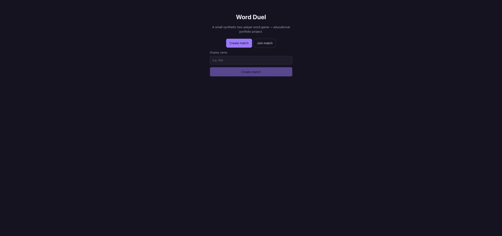
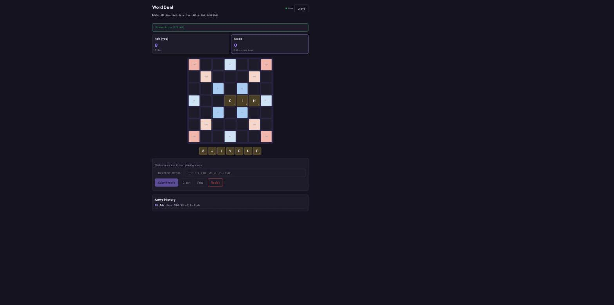
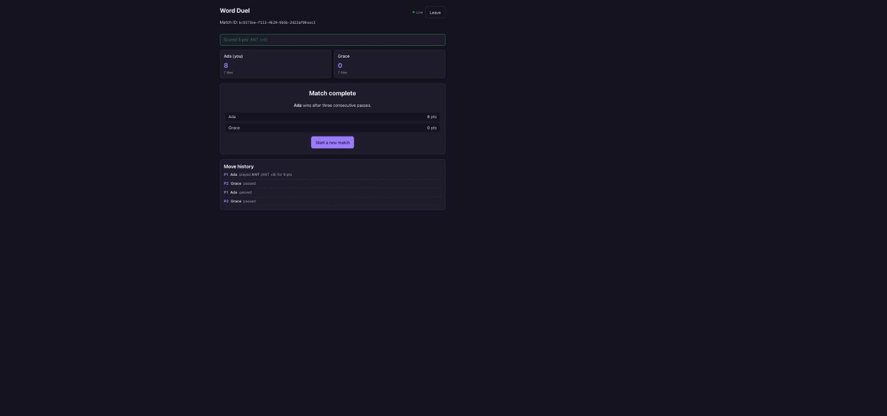

# Word Duel

A small, synthetic two-player word game built as an **educational portfolio
project**. It demonstrates a C#/.NET backend (ASP.NET Core, PostgreSQL via
EF Core, Redis, SignalR) with a React + TypeScript client, covering
client-server contracts, real-time networking, transactional game state,
optimistic concurrency, idempotent retries, and automated testing.

> **This is not a real game or product.** All players, matches, scores, and
> the bundled word list are synthetic and local-only. There are no real
> accounts, no payments, no ads, and no external game APIs. It does not use,
> reproduce, or reference any Zynga/Words With Friends code, branding,
> artwork, game rules text, or proprietary interfaces — the board layout,
> tile distribution, and scoring bonuses are original to this project.





## Quick start

Requires [Docker](https://www.docker.com/) (with Compose). Nothing else.

```bash
docker compose up -d --build
```

That's it — the compose file ships with safe local-dev defaults for every
setting (see `.env.example` if you want to override ports or the JWT
signing key). Wait for all four services to report healthy:

```bash
docker compose ps
```

Then open the app:

- Web client: <http://localhost:3000>
- API (Swagger UI in dev, health checks always on): <http://localhost:5080/health>, <http://localhost:5080/ready>

Open the web client in **two browser tabs** (or two different browsers) to
play a full match: create a match in the first tab, copy the match ID it
shows, and join with it in the second tab.

To stop everything: `docker compose down` (add `-v` to also drop the
Postgres volume).

### Scripted resilience demo

With the stack running, `./scripts/demo.sh` plays out a match via curl and
demonstrates:

- a duplicate move request (same `Idempotency-Key`) being rejected from
  double-scoring,
- a stale-match-version request being rejected with `409`,
- an invalid placement being rejected without mutating state,
- a "reconnect" (a fresh `GET`) returning the authoritative current snapshot.

```bash
./scripts/demo.sh                    # defaults to http://localhost:5080
./scripts/demo.sh http://localhost:5080
```

Requires `jq`.

## Local development (without Docker)

Backend (.NET 10 SDK, plus a local Postgres and Redis — e.g.
`docker compose up -d postgres redis`):

```bash
dotnet restore
dotnet run --project src/WordDuel.Api
```

Uses `src/WordDuel.Api/appsettings.Development.json`, which points at
`localhost:5432`/`localhost:6379` by default — adjust if you're running
Postgres/Redis on other ports. Migrations apply automatically on startup.

Client (Node 22+):

```bash
cd src/word-duel-web
npm install
npm run dev
```

Opens on <http://localhost:5173>; Vite proxies `/api` and `/hubs` to
`http://localhost:5080` (see `vite.config.ts`), so no CORS setup is needed.

## Testing

```bash
# Unit tests — pure domain rules, no external dependencies
dotnet test tests/WordDuel.UnitTests

# Integration tests — real Postgres + Redis via Testcontainers, full HTTP + SignalR
dotnet test tests/WordDuel.IntegrationTests

# Client type check + build
cd src/word-duel-web && npm run build && npm run lint

# End-to-end browser test (requires the stack running via docker compose)
cd tests/word-duel-e2e && npm install && npx playwright install --with-deps chromium
BASE_URL=http://localhost:3000 npx playwright test
```

All of the above also run in CI on every push/PR — see
`.github/workflows/ci.yml`.

## API contract

Base URL: `/api/matches`. Full request/response DTOs are in
`src/WordDuel.Api/Dtos/MatchDtos.cs`; interactive docs are at `/swagger` in
development.

| Method | Path | Auth | Notes |
|---|---|---|---|
| `POST` | `/api/matches` | — | Create a match; returns the creator's player token + rack |
| `POST` | `/api/matches/{id}/join` | — | Join as the second player; starts the match |
| `GET` | `/api/matches/{id}` | optional | Public snapshot; with a bearer token, also includes your own rack |
| `POST` | `/api/matches/{id}/moves` | required | Submit a word placement |
| `POST` | `/api/matches/{id}/pass` | required | Pass the turn |
| `POST` | `/api/matches/{id}/resign` | required | Resign (opponent wins) |
| `GET` | `/api/matches/{id}/moves` | — | Full move history |
| `GET` | `/health` | — | Liveness |
| `GET` | `/ready` | — | Readiness (checks Postgres + Redis) |

Example: create a match, then submit a move.

```bash
curl -s -X POST localhost:5080/api/matches \
  -H 'Content-Type: application/json' \
  -d '{"displayName":"Ada"}'
# => { "matchId": "...", "playerId": "...", "playerToken": "...", "rack": "CATDOGS", "match": { ... } }

curl -s -X POST localhost:5080/api/matches/$MATCH_ID/moves \
  -H 'Content-Type: application/json' \
  -H "Authorization: Bearer $TOKEN" \
  -H "Idempotency-Key: $(uuidgen)" \
  -d '{"expectedMatchVersion":2,"startRow":3,"startCol":1,"direction":"Across","tiles":"CAT"}'
```

`tiles` is the full word run as it will read after the move, including any
letters already on the board it overlaps — see
[`docs/architecture.md`](docs/architecture.md#move-wire-format-and-validation-order)
for why.

Errors are [RFC 7807](https://www.rfc-editor.org/rfc/rfc7807) Problem
Details with an additional machine-readable `errorCode` (e.g.
`NotYourTurn`, `StaleMatchVersion`, `WordNotInDictionary`) and, for version
conflicts, `currentMatchVersion`.

## Architecture

See [`docs/architecture.md`](docs/architecture.md) for the system diagram,
key design decisions (deterministic match setup, move validation order,
optimistic concurrency + idempotency, per-match JWT auth, real-time
broadcast/reconnect strategy, caching), and known limitations.

## Repository layout

```text
src/WordDuel.Domain/          Game rules (board, tiles, dictionary, scoring) — no dependencies
src/WordDuel.Infrastructure/  EF Core + PostgreSQL, Redis cache
src/WordDuel.Api/             ASP.NET Core Web API, SignalR hub, JWT auth
src/word-duel-web/            React + TypeScript client (Vite)
tests/WordDuel.UnitTests/     xUnit — domain rules and scoring
tests/WordDuel.IntegrationTests/  xUnit + Testcontainers — real Postgres/Redis, HTTP, SignalR
tests/word-duel-e2e/          Playwright — full two-player browser flow
docs/architecture.md
docker-compose.yml
scripts/demo.sh
```

## Resume-safe summary

> Built a C#/.NET multiplayer word-game service with ASP.NET Core,
> PostgreSQL, Redis, and SignalR, enforcing transactional turn-based moves,
> JSON API contracts, optimistic concurrency, and idempotent retries.
>
> Delivered a React/TypeScript client with real-time board updates and
> clear validation states, backed by xUnit, integration, and Playwright
> tests and a Docker Compose development workflow.

No claims of Unity, mobile deployment, production traffic, AWS deployment,
Protobuf, Ruby on Rails, or measured latency — none of that was built here.
