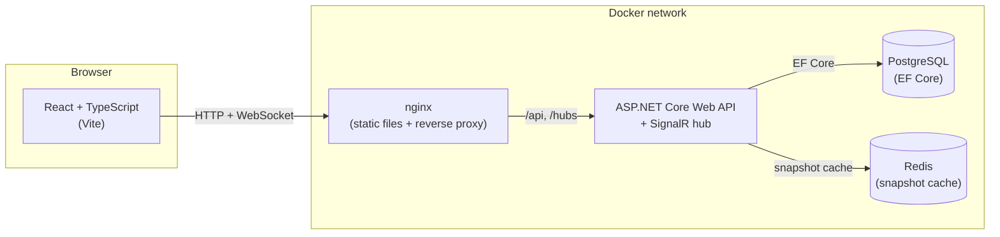

# Word Duel — Architecture

Word Duel is an educational portfolio project: a small, synthetic two-player
word game built to demonstrate C#/.NET backend engineering (ASP.NET Core,
EF Core/PostgreSQL, Redis, SignalR) alongside a React/TypeScript client. It
is not a commercial product and contains no real player data, accounts, or
payments — see the [README](../README.md) for the synthetic-data disclosure.

## System overview



In local development (`npm run dev`), Vite's dev server proxies `/api` and
`/hubs` to the API directly instead of nginx, so the client code is
identical in both modes — it only ever calls relative paths.

## Project layout

```text
src/WordDuel.Domain/         Pure game rules — no persistence, no ASP.NET Core
src/WordDuel.Infrastructure/ EF Core DbContext/migrations, Redis cache
src/WordDuel.Api/            Controllers, SignalR hub, auth, application services
src/word-duel-web/           React + TypeScript client (Vite)
tests/WordDuel.UnitTests/    Domain rule + scoring unit tests
tests/WordDuel.IntegrationTests/  Real Postgres + Redis (Testcontainers) + HTTP + SignalR
tests/word-duel-e2e/         Playwright browser test
```

`WordDuel.Domain` has zero dependencies on EF Core, ASP.NET Core, or any
infrastructure concern — `Board`, `Tiles`, `WordList`, and `Rules` are plain
C# operating on in-memory value types (`GameBoard`, `Rack`, `TileBag`). This
is what makes the scoring/placement rules exhaustively unit-testable without
a database.

## Core game design decisions

### Board and tiles

- 7×7 board with an original, symmetric bonus-square layout
  (`BoardLayout.cs`) — not copied from any commercial word game.
- An original 26-letter distribution and point-value table (`LetterValues.cs`),
  82 tiles total, sized for a 7×7 board and two players (deliberately not the
  same counts as Scrabble's 100-tile bag).
- A small bundled dictionary (`WordList/words.txt`, ~3,300 common English
  words, 2–8 letters) loaded once as an embedded resource into a `HashSet<string>`.

### Deterministic-but-unpredictable setup

Each match's tile bag is shuffled with a `System.Random` seeded from a hash
of the match's own GUID (`BoardSeedFactory`). This makes match setup
**reproducible** (the same match ID always draws the same tile sequence,
which is what "deterministic" means here and is exactly what the unit tests
rely on) while remaining **unpredictable ahead of time**, since match IDs are
random GUIDs. Tile-bag state is never persisted as a list — it's
reconstructed on demand from `(seed, tilesAlreadyDrawn)`, so `MatchEntity`
only needs to store a running draw counter.

### Move wire format and validation order

A placement is submitted as `{ startRow, startCol, direction, tiles }`,
where `tiles` is the **full word run as it will read after the move**,
including letters over cells that are already occupied. The server:

1. Bounds-checks the run against the 7×7 board.
2. Walks each cell: if occupied, the submitted letter must match exactly
   (`OverlapConflict` otherwise); if empty, that letter is a new tile drawn
   from the rack.
3. Rejects if no new tiles were placed, or if the rack doesn't hold them
   (`TilesNotInRack`).
4. Enforces first-move-covers-center, or adjacency-to-an-existing-tile for
   later moves (`FirstMoveMustCoverStart` / `NotConnected`).
5. Reads out the main word and every crossing word formed by a newly placed
   tile, requiring each (length ≥ 2) to be in the dictionary
   (`WordNotInDictionary`), then scores them — letter/word bonus squares
   apply only to newly placed cells, and using all 7 rack tiles in one move
   earns a +20 "full rack" bonus.

This ordering (turn/state checks → overlap/rack → connectivity → dictionary)
is what `WordDuel.Api.Errors.GameErrorCodeHttpMapper` maps to HTTP status:
404 for a missing match, 403 for a token/match mismatch, 409 for
state/version/turn conflicts, 422 for everything else that's a well-formed
but invalid placement.

## Concurrency and idempotency

- **Optimistic concurrency**: `MatchEntity.Version` is both an
  application-level field the client must echo back
  (`expectedMatchVersion`) and an EF Core concurrency token. A client-side
  mismatch is caught before touching the database; a true race between two
  in-flight requests is caught by EF's own `WHERE Version = @original`
  check, which throws `DbUpdateConcurrencyException` if another request
  already committed. Both paths return **409** with the current version, so
  the client can resync and retry.
- **Idempotent moves**: an optional `Idempotency-Key` header is checked
  against an `idempotency_records` table scoped to `(matchId, playerId,
  endpoint, key)`. On a hit, the exact original response is replayed without
  re-running any game logic — so a retried "duplicate" request can never
  double-score a move. Only successful responses are cached; a failed
  request never mutated state, so retrying it is safe by construction and
  doesn't need caching.
- All of this happens inside one EF Core transaction per mutating request
  (`BeginTransactionAsync` → mutate → `SaveChangesAsync` → `Commit`), so a
  move's board update, rack update, score update, turn advance, and move-log
  row are all-or-nothing.

See `scripts/demo.sh` for a runnable demonstration of a duplicate request
being rejected safely, a stale-version request being rejected, and a
reconnect fetching the current snapshot.

## Auth: per-match player tokens

There are no user accounts. Creating or joining a match returns a
short-lived JWT (HMAC-SHA256, `Jwt:SigningKey` from configuration) carrying
`sub` (player ID), `match_id`, and `seat` claims. Mutating endpoints
(`POST .../moves|pass|resign`) require this token and verify its `match_id`
claim against the route; `GET` endpoints are public but read an *optional*
bearer token to additionally include the caller's own rack (`yourRack`,
`yourSeat`, `isYourTurn`) — never the opponent's. This is also how the
SignalR hub authenticates: the browser passes the token as
`?access_token=` on the WebSocket upgrade (the only way to authenticate a
WebSocket handshake from a browser), and `MatchHub.OnConnectedAsync` places
the connection into a group scoped to that match.

## Real-time updates and reconnection

`IMatchNotifier` broadcasts a **public-only** `MatchSnapshotDto` (board,
scores, turn, status — never rack letters) to the match's SignalR group
after every successful mutation. Each player's own rack only ever reaches
them directly: in the response body of their own create/join/move call, or
via `GET /api/matches/{id}` with their bearer token. This means the shared
broadcast channel can never leak an opponent's tiles.

Reconnection needs no special protocol: the client always treats the server
as the source of truth rather than trusting buffered events. On page load,
tab focus, or SignalR reconnect, it re-fetches
`GET /api/matches/{id}` (with its token) and replaces local state wholesale.
Session identity (match ID, player ID, token, seat) is kept in
`sessionStorage`, not `localStorage` — deliberately scoped per browser tab,
so that two players tested locally in two tabs of the same browser don't
clobber each other's session, while a same-tab refresh still restores it.

## Caching

`WordDuel.Infrastructure.Caching.IMatchCache` wraps Redis as a plain
string get/set/delete cache. The API serializes the **public** snapshot
into it as a write-through cache after every mutation and on an anonymous
`GET` miss, keyed `wordduel:match:{id}:snapshot`. A Redis failure never
fails a request — it's logged and the response still comes from Postgres,
since Redis here is purely a read-path optimization, not a source of truth.

## Persistence

Four tables: `matches`, `players`, `moves`, `idempotency_records`. The
current board is stored as a flat 49-character string on `MatchEntity`
(`.` = empty) rather than 49 rows, since the whole board is always read and
written together. `moves` is an append-only log (used for
`GET .../moves` and the demo script) and is never the source for current
board state — `MatchEntity.BoardStateFlat` is.

## Known limitations

- No reconnection grace period or forfeit-on-timeout: a match with an
  absent player simply waits; there's no clock.
- No spectator mode beyond the public (rack-free) `GET` — a third party can
  poll match state but the UI doesn't have a dedicated spectator view.
- No horizontal scaling story for SignalR (no Redis/Azure SignalR backplane)
  — fine for one API instance, would need a backplane to run multiple.
  The Redis dependency in this project is only used for the snapshot cache.
- The bundled dictionary is a curated common-word list (~3,300 entries),
  not a full dictionary — some valid English words will be rejected.
- No automated content moderation on display names (synthetic/local use only).
